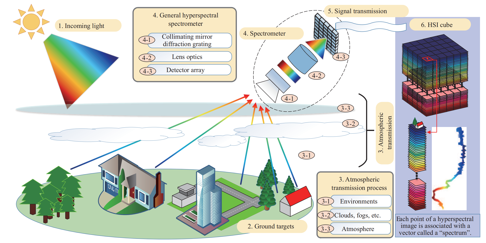

# Hyperspectral Remote Sensing

  
   
  (From SCIS2023)

I am currently working on tensor model-guided data-driven approaches in hyperspectral remote sensing.
  - [Surveys](#Surveys)
  - [Classification](#Classification)
  - [Clustering](#Clustering)
  - [Denoising](#Denoising)
  - [Detection](#Detection)
  - [Fusion](#Fusion)
  - [Pansharpening](#Pansharpening)
  - [Superresolution](#Superresolution)
  - [Unmixing](#Unmixing)
  - [Journals](#Journals)
  - [Links](#Links)

<strong> Last Update: 2023/11/25 </strong>

<a name="Surveys" />

## Surveys
- [2023] From Single- to Multi-Modal Remote Sensing Imagery Interpretation: A Survey and Taxonomy, Science China Information Sciences [[Paper](https://link.springer.com/article/10.1007/s11432-022-3588-0)]
- [2023] Remote Sensing Object Detection Meets Deep Learning: A Meta-Review of Challenges and Advances, arXiv [[Paper](https://arxiv.org/abs/2309.06751)]
- [2023] Tensor Decompositions for Hyperspectral Data Processing in Remote Sensing: A Comprehensive Review, IEEE GRSM [[Paper](https://ieeexplore.ieee.org/abstract/document/10035509)]
- [2023] A Survey on Hyperspectral Image Restoration: From the View of Low-Rank Tensor Approximation, Science China Information Sciences [[Paper](https://link.springer.com/article/10.1007/s11432-022-3609-4)]
- [2023] Multispectral and Hyperspectral Image Fusion In Remote Sensing: A Survey, Information Fusion [[Paper](https://www.sciencedirect.com/science/article/pii/S1566253522001312)]
- [2023] Hyperspectral Image Denoising: From Model-Driven, Data-Driven, to Model-Data-Driven, IEEE TNNLS [[Paper](https://ieeexplore.ieee.org/abstract/document/10144690)]
- [2023] Deep Learning in Multimodal Remote Sensing Data Fusion: A Comprehensive Review, International Journal of Applied Earth Observation and Geoinformation [[Paper](https://ieeexplore.ieee.org/abstract/document/10144690)]
- [2023] Integration of Physics-Based and Data-Driven Models for Hyperspectral Image Unmixing: A Summary of Current Methods, IEEE SPM [[Paper](https://ieeexplore.ieee.org/document/10054209)] 
- [2022] Hyperspectral Image Classification—Traditional to Deep Models: A Survey for Future Prospects, IEEE JSTARS [[Paper](https://ieeexplore.ieee.org/abstract/document/9645266)]
- [2022] Low-Rank and Sparse Representation for Hyperspectral Image Processing: A Review, IEEE GRSM [[Paper](https://ieeexplore.ieee.org/abstract/document/9451654)]
- [2022] Hyperspectral Unmixing Based on Nonnegative Matrix Factorization: A Comprehensive Review, IEEE JSTARS [[Paper](https://ieeexplore.ieee.org/document/9775570)]
- [2022] Machine Learning in Pansharpening: A Benchmark, from Shallow to Deep Networks, IEEE GRSM [[Paper](https://ieeexplore.ieee.org/document/9844267)] [[Python](https://github.com/liangjiandeng/DLPan-Toolbox)]
- [2022] Hyperspectral Anomaly Detection Based on Machine Learning: An Overview, IEEE JSTARS [[Paper](https://ieeexplore.ieee.org/abstract/document/9760098)]
- [2022] Hyperspectral Anomaly Detection: A Survey, IEEE GRSM [[Paper](https://ieeexplore.ieee.org/document/9532003)]
- [2022] Hyperspectral Anomaly Detection Using Deep Learning: A Review, Remote Sensing [[Paper](https://www.mdpi.com/2072-4292/14/9/1973)]
- [2022] Domain Adaptation in Remote Sensing Image Classification: A Surveys, IEEE JSTARS [[Paper](https://ieeexplore.ieee.org/abstract/document/9944086)]
- [2022] Multi-View Learning for Hyperspectral Image Classification: An Overview, Neurocomputing [[Paper](https://www.sciencedirect.com/science/article/abs/pii/S0925231222006762)]
- [2021] Recent Advances and New Guidelines on Hyperspectral and Multispectral Image Fusion, Information Fusion [[Paper](https://www.sciencedirect.com/science/article/pii/S1566253520304103)]
- [2021] Hyperspectral Image Classification—Traditional to Deep Models: A Survey for Future Prospects, IEEE JSTARS [[Paper](https://ieeexplore.ieee.org/abstract/document/9645266)]
- [2021] Multimodal Hyperspectral Remote Sensing: An Overview and Perspective, Science China Information Sciences [[Paper](https://link.springer.com/article/10.1007/s11432-020-3084-1)]
- [2021] Interpretable Hyperspectral Artificial Intelligence: When Non-Convex Modeling meets Hyperspectral Remote Sensing, IEEE GRSM [[Paper](https://ieeexplore.ieee.org/abstract/document/9395693)]
- [2021] A Survey: Deep Learning for Hyperspectral Image Classification with Few Labeled Samples, Neurocomputing [[paper]([https://www.sciencedirect.com/science/article/pii/S0925231221004033)] [[code](https://github.com/ShuGuoJ/HSI-Classification)]  
- [2021] Hyperspectral Image Classification—Traditional to Deep Models: A Survey for Future Prospects, IEEE JSTARS [[Paper](https://ieeexplore.ieee.org/abstract/document/9645266)] [[Python](https://github.com/AnkurDeria/HSI-Traditional-to-Deep-Models)] 
- [2020] Feature Extraction for Hyperspectral Imagery: The Evolution from Shallow to Deep: Overview and Toolbox, IEEE GRSM [[Paper](https://ieeexplore.ieee.org/abstract/document/9082155)] [[Matlab](https://github.com/danfenghong/HyFTech)] 
- [2020] Recent Advances of Hyperspectral Imaging Technology and Applications in Agriculture, Remote Sensing [[Paper](https://www.mdpi.com/2072-4292/12/16/2659)] 

<a name="Classification" />

## Classification
- [2023] Universal Domain Adaptation for Remote Sensing Image Scene Classification, IEEE TGRS [[Paper](https://ieeexplore.ieee.org/document/10043671)] [[Python](https://github.com/zhu-xlab/UniDA)]
- [2023] UCSL: Toward Unsupervised Common Subspace Learning for Cross-Modal Image Classification, IEEE TGRS [[Paper](https://ieeexplore.ieee.org/document/10144390)] [[Matlab](https://github.com/jingyao16/UCSL)]
- [2023] Multilevel Spatial Feature-Based Manifold Metric Learning for Domain Adaptation in Remote Sensing Image Classification, IEEE TGRS [[Paper](https://ieeexplore.ieee.org/document/10285503)] 
- [2022] Weighted Correlation Embedding Learning for Domain Adaptation, IEEE TIP [[Paper](https://ieeexplore.ieee.org/abstract/document/9846882)] [[Matlab](https://github.com/danfenghong/HyFTech)]
- [2022] Unsupervised Domain-Adaptation-Based Tensor Feature Learning With Structure Preservation, IEEE TAI [[Paper](https://ieeexplore.ieee.org/document/9744422)]  [[Matlab](https://github.com/alibraytee/UDA-TFL)]
- [2020] Domain Adaptation Based on Correlation Subspace Dynamic Distribution Alignment for Remote Sensing Image Scene Classification, IEEE TGRS [[Paper](https://ieeexplore.ieee.org/abstract/document/9070187)] 
- [2019] CoSpace: Common Subspace Learning From Hyperspectral-Multispectral Correspondences, IEEE TGRS [[Paper](https://ieeexplore.ieee.org/document/8672122)] [[Matlab](https://drive.google.com/open?id=1ErfS0-4-wXYjOPQAv3w5c7b3AW9vHKHD)]
- [2019] Manifold Criterion Guided Transfer Learning via Intermediate Domain Generation, IEEE TNNLS [[Paper](https://ieeexplore.ieee.org/abstract/document/8674784)] [[Matlab](https://github.com/wangshanshanCQU/MCTL)] 
- [2019] LSDT: Latent Sparse Domain Transfer Learning for Visual Adaptation, IEEE TIP [[Paper](https://ieeexplore.ieee.org/abstract/document/7378504)]
- [2017] Structure Preserving Transfer Learning for Unsupervised Hyperspectral Image Classification, IEEE GRSL [[Paper](https://ieeexplore.ieee.org/abstract/document/8010416)] 
- [2017] Domain Adaptation Using Representation Learning for the Classification of Remote Sensing Images, IEEE JSTARS [[Paper](https://ieeexplore.ieee.org/abstract/document/7954001)]
- [2016] Domain Adaptation for the Classification of Remote Sensing Data: An Overview of Recent Advances, IEEE GRSM [[Paper](https://ieeexplore.ieee.org/abstract/document/7486184)] 
- [2015] Semisupervised Transfer Component Analysis for Domain Adaptation in Remote Sensing Image Classification, IEEE TGRS [Paper](https://ieeexplore.ieee.org/abstract/document/7027189)] 

<a name="Clustering" />

## Clustering
- [2023] Diffusion Subspace Clustering for Hyperspectral Images, IEEE JSTARS [[Paper](https://ieeexplore.ieee.org/abstract/document/10179942)]
- [2022] Sparsity Regularized Deep Subspace Clustering for Multicriterion-Based Hyperspectral Band Selection, IEEE TGRS [[Paper](https://ieeexplore.ieee.org/document/9767632)]
- [2022] Heterogeneous Regularization-Based Tensor Subspace Clustering for Hyperspectral Band Selection, IEEE TNNLS [[Paper](https://ieeexplore.ieee.org/abstract/document/9737043)]
- [2022] Deep Low-Rank Graph Convolutional Subspace Clustering for Hyperspectral Image, IEEE TGRS [[Paper](https://ieeexplore.ieee.org/abstract/document/9825691)]
- [2022] Tensorial Multiview Subspace Clustering for Polarimetric Hyperspectral Images, IEEE TGRS [[Paper](https://ieeexplore.ieee.org/abstract/document/9774396)]
- [2022] Subspace Clustering for Hyperspectral Images via Dictionary Learning With Adaptive Regularization, IEEE TGRS [[Paper](https://ieeexplore.ieee.org/abstract/document/9612216)] [[Python](https://github.com/AngryCai/NCSC)]
- [2022] Superpixel Contracted Neighborhood Contrastive Subspace Clustering Network for Hyperspectral Images, IEEE TGRS [[Paper](https://ieeexplore.ieee.org/abstract/document/9785997)]
- [2022] Graph Regularized Spatial-spectral Subspace Clustering for Hyperspectral Band Selection, Neural Networks [[Paper](https://www.sciencedirect.com/science/article/abs/pii/S0893608022002313)] [[Matlab](https://github.com/WangJun2023/GRSC)] 
- [2021] A Fast and Accurate Similarity-Constrained Subspace Clustering Algorithm for Hyperspectral Image, IEEE JSTARS [[Paper](https://ieeexplore.ieee.org/abstract/document/9573388)] [[Matlab](https://github.com/carlosh93/SC-SSC)] 
- [2021] Deep Spatial-Spectral Subspace Clustering for Hyperspectral Image, IEEE TCSVT [[Paper](https://ieeexplore.ieee.org/abstract/document/9208699)]
- [2021] Subspace Clustering for Hyperspectral Images via Dictionary Learning With Adaptive Regularization, IEEE TGRS [[Paper](https://ieeexplore.ieee.org/abstract/document/9612216)]
- [2021] Hybrid-Hypergraph Regularized Multiview Subspace Clustering for Hyperspectral Images, IEEE TGRS [[Paper](https://ieeexplore.ieee.org/abstract/document/9420759)]
- [2020] Multi-Objective Sparse Subspace Clustering for Hyperspectral Imagery, IEEE TGRS [[Paper](https://ieeexplore.ieee.org/abstract/document/8894542)]
- [2020] Graph Convolutional Subspace Clustering: A Robust Subspace Clustering Framework for Hyperspectral Image, IEEE TGRS [[Paper](https://ieeexplore.ieee.org/abstract/document/9181470)] [[Python](https://github.com/AngryCai/GraphConvSC)]
- [2019] Laplacian-Regularized Low-Rank Subspace Clustering for Hyperspectral Image Band Selection, IEEE TGRS [[Paper](https://ieeexplore.ieee.org/abstract/document/8485428)] 

<a name="Denoising" />

## Denoising
- [2023] FastHyMix: Fast and Parameter-Free Hyperspectral Image Mixed Noise Removal, IEEE TNNLS [[Paper](https://ieeexplore.ieee.org/document/9552462)] [[Matlab](https://github.com/LinaZhuang/HSI-MixedNoiseRemoval-FastHyMix)]  
- [2023] A New Nonconvex Low-Rank Tensor Approximation Method with Applications to Hyperspectral Images Denoising, Inverse Problems [[Paper](https://iopscience.iop.org/article/10.1088/1361-6420/acc88a/meta)] 
- [2023] Tuning-free Plug-and-Play Hyperspectral Image Deconvolution with Deep Priors, IEEE TGRS [[Paper](https://ieeexplore.ieee.org/abstract/document/10061448)] [[Python](https://github.com/xiuheng-wang/Tuning_free_PnP_HSI_deconvolution)]  
- [2023] Content-Aware Subspace Low-Rank Tensor Recovery for Hyperspectral Image Restoration, IEEE TGRS [[Paper](https://ieeexplore.ieee.org/document/10238728)]
- [2023] Deep Tensor Attention Prior Network for Hyperspectral Image Denoising, IEEE JSTARS [[Paper](https://ieeexplore.ieee.org/abstract/document/10179990)]
- [2023] Hyperspectral Image Denoising via Weighted Multidirectional Low-Rank Tensor Recovery, IEEE TC [[Paper](https://ieeexplore.ieee.org/abstract/document/9920675)]
- [2023] Nonlocal Structured Sparsity Regularization Modeling for Hyperspectral Image Denoising, IEEE TGRS [[Paper](https://ieeexplore.ieee.org/abstract/document/10106506)]
- [2023] Combined Deep Priors With Low-Rank Tensor Factorization for Hyperspectral Image Restoration, IEEE GRSL [[Paper](https://ieeexplore.ieee.org/abstract/document/10015865)]
- [2023] Multitask Sparse Representation Model-Inspired Network for Hyperspectral Image Denoising, IEEE TGRS [[Paper](https://ieeexplore.ieee.org/abstract/document/10198268)]
- [2022] Non-Local Meets Global: An Iterative Paradigm for Hyperspectral Image Restoration, IEEE TPAMI [[Paper](https://ieeexplore.ieee.org/document/9208755)] [[Matlab](https://github.com/quanmingyao/NGMeet)]  
- [2022] SMDS-Net: Model Guided Spectral-Spatial Network for Hyperspectral Image Denoising, IEEE TIP [[Paper](https://ieeexplore.ieee.org/abstract/document/9855427)] [[Python](https://github.com/bearshng/smds-net)]  
- [2022] Fast Noise Removal in Hyperspectral Images via Representative Coefficient Total Variation, IEEE TGRS  [[Paper](https://ieeexplore.ieee.org/abstract/document/9989343)] [[Matlab](https://github.com/andrew-pengjj/rctv.git)]  
- [2022] Hyperspectral Image Denoising by Asymmetric Noise Modeling, IEEE TGRS  [[Paper](https://ieeexplore.ieee.org/abstract/document/9975834)]
- [2022] Deep Plug-and-Play Prior for Hyperspectral Image Restoration, Neurocomputing  [[Paper](https://www.sciencedirect.com/science/article/abs/pii/S092523122200073X)]  [[Python](https://github.com/Zeqiang-Lai/DPHSIR)]  
- [2022] Adaptive Rank and Structured Sparsity Corrections for Hyperspectral Image Restoration, IEEE TC [[Paper](https://ieeexplore.ieee.org/abstract/document/9359537)]
- [2022] Cooperated Spectral Low-Rankness Prior and Deep Spatial Prior for HSI Unsupervised Denoising, IEEE TIP [[Paper](https://ieeexplore.ieee.org/abstract/document/9913829)]
- [2022] Hyperspectral Image Denoising Using Spectral-Spatial Transform-Based Sparse and Low-Rank Representations, IEEE TGRS  [[Paper](https://ieeexplore.ieee.org/abstract/document/9680733)]
- [2021] Multigraph-Based Low-Rank Tensor Approximation for Hyperspectral Image Restoration, IEEE TGRS  [[Paper](https://ieeexplore.ieee.org/document/9781310)] [[Matlab](https://openremotesensing.net/knowledgebase/tensor-low-rank-constraint-and-l0-total-variation-for-hyperspectral-image-mixed-noise-removal/)]
- [2021] Hy-Demosaicing: Hyperspectral Blind Reconstruction From Spectral Subsampling, IEEE TGRS  [[Paper](https://ieeexplore.ieee.org/document/9513279)] [[Matlab](https://github.com/LinaZhuang/Hy-demosaicing)]
- [2021] LR-Net: Low-Rank Spatial-Spectral Network for Hyperspectral Image Denoising, IEEE TIP [[Paper](https://ieeexplore.ieee.org/abstract/document/9580717)]
- [2021] A Trainable Spectral-Spatial Sparse Coding Model for Hyperspectral Image Restoration, NIPS  [[Paper](https://proceedings.neurips.cc/paper/2021/hash/2b515e2bdd63b7f034269ad747c93a42-Abstract.html)] [[Python](https://github.com/inria-thoth/T3SC)]
- [2021] L0-L1 Hybrid Total Variation Regularization and its Applications on Hyperspectral Image Mixed Noise Removal and Compressed Sensing, IEEE TGRS [[Paper](https://ieeexplore.ieee.org/document/9354456)] [[Matlab](https://openremotesensing.net/knowledgebase/l%e2%82%80-l%e2%82%81-hybrid-total-variation-regularization-and-its-applications-on-hyperspectral-image-mixed-noise-removal-and-compressed-sensing/)] 
- [2021] MAC-Net: Model Aided Nonlocal Neural Network for Hyperspectral Image Denoising, IEEE TGRS [[Paper](https://ieeexplore.ieee.org/abstract/document/9631264)] [[Python](https://github.com/bearshng/mac-net)]
- [2021] Hyperspectral Image Restoration by Tensor Fibered Rank Constrained Optimization and Plug-and-Play Regularization, IEEE TGRS [[Paper](https://ieeexplore.ieee.org/abstract/document/9314228)] [[Matlab](https://github.com/YuBangZheng/code_TGRS_low-fibered-rank)]
- [2021] Total Variation Regularized Weighted Tensor Ring Decomposition for Missing Data Recovery in High-Dimensional Optical Remote Sensing Images, IEEE GRSL [[Paper](https://ieeexplore.ieee.org/document/9399661)] [[Matlab](https://openremotesensing.net/knowledgebase/total-variation-regularized-weighted-tensor-ring-decomposition-for-missing-data-recovery-in-high-dimensional-optical-remote-sensing-images/)]
- [2021] Hyperspectral Image Denoising via Low-Rank Representation and CNN Denoiser, IEEE JSTARS [[Paper](https://ieeexplore.ieee.org/document/9664348)]
- [2020] Double-Factor-Regularized Low-Rank Tensor Factorization for Mixed Noise Removal in Hyperspectral Image, IEEE TGRS [[Paper](https://ieeexplore.ieee.org/abstract/document/9084248)] [[Matlab](https://github.com/YuBangZheng/code_LRTFDFR)]
- [2020] Hyperspectral Image Restoration via CNN Denoiser Prior Regularized Low-Rank Tensor Recovery, Computer Vision and Image Understanding [[Paper](https://www.sciencedirect.com/science/article/abs/pii/S1077314220300710)] [[Python](https://github.com/NavyZeng/DPLRTA)] 
- [2019] Hyperspectral Image Denoising via Matrix Factorization and Deep Prior Regularization, IEEE TIP [[Paper](https://ieeexplore.ieee.org/document/8767025)]
- [2018] Hyperspectral Image Restoration Via Total Variation Regularized Low-Rank Tensor Decomposition, IEEE JSTARS [[Paper](https://ieeexplore.ieee.org/abstract/document/8233403)] [[Matlab](https://github.com/zhaoxile/Hyperspectral-Image-Restoration-via-Total-Variation-Regularized-Low-rank-Tensor-Decomposition)] 

<a name="Detection" />

## Detection
- [2023] Anomaly Detection for Hyperspectral Imagery via Tensor Low-Rank Approximation With Multiple Subspace Learning, IEEE TGRS [[Paper](https://ieeexplore.ieee.org/stamp/stamp.jsp?tp=&arnumber=10108976)]
- [2023] Learning Tensor Low-Rank Representation for Hyperspectral Anomaly Detection, IEEE TC [[Paper](https://ieeexplore.ieee.org/abstract/document/9781337)] [[Matlab](https://openremotesensing.net/knowledgebase/learning-tensor-low-rank-representation-for-hyperspectral-anomaly-detection/)]
- [2023] A Model-Driven Deep Mixture Network for Robust Hyperspectral Anomaly Detection, IEEE TGRS [[Paper](https://ieeexplore.ieee.org/abstract/document/10234436)]
- [2023] LRR-Net: An Interpretable Deep Unfolding Network for Hyperspectral Anomaly Detection, IEEE TGRS [[Paper](https://ieeexplore.ieee.org/abstract/document/10136197)]
- [2023] Hyperspectral Anomaly Detection via Structured Sparsity Plus Enhanced Low-Rankness, IEEE TGRS [[Paper](https://ieeexplore.ieee.org/abstract/document/10148989)]
- [2022] Hyperspectral Anomaly Detection With Relaxed Collaborative Representation, IEEE TGRS [[Paper](https://ieeexplore.ieee.org/abstract/document/9826842)]
- [2022] Deep Low-Rank Prior for Hyperspectral Anomaly Detection, IEEE TGRS [[Paper](https://ieeexplore.ieee.org/abstract/document/9756439)]
- [2022] Prior-Based Tensor Approximation for Anomaly Detection in Hyperspectral Imagery, IEEE TNNLS [[Paper](https://ieeexplore.ieee.org/abstract/document/9288702)][[Matlab](https://github.com/l7170/PTA-HAD.git)]
- [2022] Hyperspectral Anomaly Detection With Tensor Average Rank and Piecewise Smoothness Constraints, IEEE TNNLS [[Paper](https://ieeexplore.ieee.org/abstract/document/9728731)]
- [2022] Tensor Recovery With Weighted Tensor Average Rank, IEEE TNNLS [[Paper](https://ieeexplore.ieee.org/abstract/document/9804376)][[Matlab](https://github.com/jzheng20/jzheng20.github.io/blob/master/files/WTAR.zip)]
- [2022] Tensor Decomposition-Inspired Convolutional Autoencoders for Hyperspectral Anomaly Detection, IEEE JSTARS [[Paper](https://ieeexplore.ieee.org/abstract/document/9802669)]
- [2022] Moving Vehicle Detection for Remote Sensing Video Surveillance with Nonstationary Satellite Platform, IEEE TPAMI [[Paper](https://ieeexplore.ieee.org/abstract/document/9380986)] 
- [2021] Hyperspectral Anomaly Detection via Deep Plug-and-Play Denoising CNN Regularization, IEEE TGRS [[Paper](https://ieeexplore.ieee.org/abstract/document/9329138)][[Matlab](https://github.com/FxyPd/DeCNNAD)]
- [2020] Graph and Total Variation Regularized Low-Rank Representation for Hyperspectral Anomaly Detection, IEEE TGRS [[Paper](https://ieeexplore.ieee.org/abstract/document/8833518)]
- [2020] Deep Plug-and-play Prior for Low-rank Tensor Completion, Neurocomputing [[Paper](https://www.sciencedirect.com/science/article/abs/pii/S0925231220303532)] [[Matlab](https://github.com/TaiXiangJiang/Deep-Plug-and-Play-Prior-for-Low-Rank-Tensor-Completion)]
- [2016] Anomaly Detection in Hyperspectral Images Based on Low-Rank and Sparse Representation, IEEE TGRS [[Paper](https://ieeexplore.ieee.org/abstract/document/7322257)] [[Matlab](https://github.com/axiqia/Anomaly-Detection-in-Hyperspectral-Images-Based-on-Low-Rank-and-Sparse-Representation)]
- [2016] A Tensor Decomposition-Based Anomaly Detection Algorithm for Hyperspectral Image, IEEE TGRS [[Paper](https://ieeexplore.ieee.org/abstract/document/7493677)]
- [2015] Background Subtraction Based on Low-Rank and Structured Sparse Decomposition, IEEE TIP [[Paper](https://ieeexplore.ieee.org/abstract/document/7076585)] [[Matlab](https://github.com/utayao/LSD_Foreground_Detection)]

<a name="Fusion" />

## Fusion
- [2023] LRRNet: A Novel Representation Learning Guided Fusion Network for Infrared and Visible Images, IEEE TPAMI [[Paper](https://ieeexplore.ieee.org/abstract/document/10105495)] [[Python](https://github.com/hli1221/imagefusion-LRRNet)]
- [2023] Integrated Spatio-Spectral–Temporal Fusion via Anisotropic Sparsity Constrained Low-Rank Tensor Approximation, IEEE TGRS [[Paper](https://ieeexplore.ieee.org/abstract/document/10149108)] 
- [2023] Distributed Nonlocal Coupled Hierarchical Tucker Decomposition for Hyperspectral Image Fusion, IEEE GRSL [[Paper](https://ieeexplore.ieee.org/abstract/document/10251417)] 
- [2022] MHF-Net: An Interpretable Deep Network for Multispectral and Hyperspectral Image Fusion, IEEE TPAMI [[Paper](https://ieeexplore.ieee.org/abstract/document/9165231)] [[Python](https://github.com/XieQi2015/MHF-net)]
- [2022] ADMM-HFNet: A Matrix Decomposition-Based Deep Approach for Hyperspectral Image Fusion, IEEE TGRS [[Paper](https://ieeexplore.ieee.org/abstract/document/9547385)] [[Python](https://github.com/liuofficial/ADMM-HFNet)]
- [2022] NMF-DuNet: Nonnegative Matrix Factorization Inspired Deep Unrolling Networks for Hyperspectral and Multispectral Image Fusion, IEEE JSTARS [[Paper](https://ieeexplore.ieee.org/abstract/document/9822395)]
- [2022] MLR-DBPFN: A Multi-Scale Low Rank Deep Back Projection Fusion Network for Anti-Noise Hyperspectral and Multispectral Image Fusion, IEEE TGRS [[Paper](https://ieeexplore.ieee.org/abstract/document/9691361)]
- [2021] Hyperspectral Restoration and Fusion with Multispectral Imagery by Recasting Low-Rank Tensor Approximation, IEEE TGRS [[Paper](https://ieeexplore.ieee.org/document/9328229)] [[Matlab](https://openremotesensing.net/knowledgebase/hyperspectral-restoration-and-fusion-with-multispectral-imagery-by-recasting-low-rank-tensor-approximation/)]
- [2021] Fusion of Hyperspectral and Multispectral Images Accounting for Localized Inter-Image Changes, IEEE TGRS [[Paper](https://ieeexplore.ieee.org/document/9594847)] [[Matlab](https://github.com/FxyPd/GSFus)]
- [2021] Hyperspectral and Multispectral Image Fusion via Graph Laplacian-Guided Coupled Tensor Decomposition, IEEE TGRS [[Paper](https://ieeexplore.ieee.org/abstract/document/9094715)]
- [2021] Hyperspectral and Multispectral Image Fusion via Nonlocal Low-Rank Tensor Approximation and Sparse Representation, IEEE TGRS [[Paper](https://ieeexplore.ieee.org/abstract/document/9103204)]
- [2021] Hyperspectral-Multispectral Image Fusion via Tensor Ring and Subspace Decompositions, IEEE JSTARS [[Paper](https://ieeexplore.ieee.org/abstract/document/9525254)] 
- [2021]Graph-Based Logarithmic Low-Rank Tensor Decomposition for the Fusion of Remotely Sensed Images, IEEE JSTARS [[Paper](https://ieeexplore.ieee.org/abstract/document/9591494)] 
- [2021] Regularizing Hyperspectral and Multispectral Image Fusion by CNN Denoiser, IEEE TNNLS [[Paper](https://ieeexplore.ieee.org/abstract/document/9069930)]
- [2020] Nonlocal Coupled Tensor CP Decomposition for Hyperspectral and Multispectral Image Fusion, IEEE TGRS [[Paper](https://ieeexplore.ieee.org/abstract/document/8835149)]
- [2020] Image Fusion via Sparse Regularization with Non-Convex Penalties, Pattern Recognition Letters [[Paper](https://www.sciencedirect.com/science/article/pii/S0167865520300325)]
- [2020] Hyperspectral and Multispectral Image Fusion via Nonlocal Low-Rank Tensor Decomposition and Spectral Unmixing, IEEE TGRS [[Paper](https://ieeexplore.ieee.org/abstract/document/9070159)]
- [2020] Nonlocal Sparse Tensor Factorization for Semiblind Hyperspectral and Multispectral Image Fusion, IEEE TC [[Paper](https://ieeexplore.ieee.org/abstract/document/8917657)]
- [2018] Spatial–Spectral-Graph-Regularized Low-Rank Tensor Decomposition for Multispectral and Hyperspectral Image Fusion, IEEE JSTARS [[Paper](https://ieeexplore.ieee.org/abstract/document/8253497)] 

<a name="Pansharpening" />

## Pansharpening
- [2023] Pansharpening With Spatial Hessian Non-Convex Sparse and Spectral Gradient Low Rank Priors, IEEE TIP [[Paper](https://ieeexplore.ieee.org/abstract/document/10091788)]
- [2023] Pansharpening Method Based on Deep Nonlocal Unfolding, IEEE TGRS [[Paper](https://ieeexplore.ieee.org/abstract/document/10155438)]
- [2023] Unsupervised Pansharpening via Low-rank Diffusion Model，arXiv [[Paper](https://arxiv.org/abs/2305.10925)]  [[Python](https://github.com/xyrui/plrdiff)]
- [2023] LRTCFPan: Low-Rank Tensor Completion Based Framework for Pansharpening, IEEE TIP [[Paper](https://ieeexplore.ieee.org/document/10054514)] [[Matlab](https://github.com/zhongchengwu/code_LRTCFPan)]
- [2023] PanFlowNet: A Flow-Based Deep Network for Pan-sharpening, ICCV [[Paper](https://openaccess.thecvf.com/content/ICCV2023/html/Yang_PanFlowNet_A_Flow-Based_Deep_Network_for_Pan-Sharpening_ICCV_2023_paper.html)] [[Python](https://github.com/yggame/PanFlowNet)]
- [2022] Panchromatic and Hyperspectral Image Fusion: Outcome of the 2022 WHISPERS Hyperspectral Pansharpening Challenge, IEEE JSTARS [[Paper](https://ieeexplore.ieee.org/document/9944883)] [[Matlab](https://openremotesensing.net/wp-content/uploads/2022/11/Mini-Toolbox-PRISMA.zip)]
- [2022] A Unified Pansharpening Method With Structure Tensor Driven Spatial Consistency and Deep Plug-and-Play Priors, IEEE TGRS [[Paper](https://ieeexplore.ieee.org/abstract/document/9966820)]
- [2021] PanCSC-Net: A Model-Driven Deep Unfolding Method for Pansharpening, IEEE TGRS [[Paper](https://ieeexplore.ieee.org/abstract/document/9559907)] [[Python](https://github.com/xiangyongcao/PanCSC-Net)]
- [2021] A Nonconvex Pansharpening Model With Spatial and Spectral Gradient Difference-Induced Nonconvex Sparsity Priors, IEEE TGRS [[Paper](https://ieeexplore.ieee.org/abstract/document/9434419)]
- [2021] Hyperspectral Pansharpening Based on Improved Deep Image Prior and Residual Reconstruction, IEEE TGRS [[Paper](https://ieeexplore.ieee.org/document/9664535)] [[Python](https://github.com/wgcban/DIP-HyperKite)]
- [2020] Hyperspectral Pansharpening With Deep Priors, IEEE TGRS [[Paper](https://ieeexplore.ieee.org/abstract/document/8750899)] 
- [2018] Learning Low-Rank Decomposition for Pan-Sharpening With Spatial-Spectral Offsets, IEEE TNNLS [[Paper](https://ieeexplore.ieee.org/abstract/document/8016676)]
- [2018] Pansharpening With Multiscale Geometric Support Tensor Machine, IEEE TGRS [[Paper](https://ieeexplore.ieee.org/abstract/document/8295005)]
- [2017] A Joint Sparse and Low-Rank Decomposition for Pansharpening of Multispectral Images, IEEE TGRS [[Paper](https://ieeexplore.ieee.org/abstract/document/7885538)]
- [2014] Pansharpening Based on Low-Rank and Sparse Decomposition, IEEE JSTARS [[Paper](https://ieeexplore.ieee.org/abstract/document/6893027)]

<a name="Superresolution" />

## Superresolution
- [2023] Bayesian Nonlocal Patch Tensor Factorization for Hyperspectral Image Super-Resolution, IEEE TIP [[Paper](https://ieeexplore.ieee.org/document/10299572)]
- [2022] Hyperspectral Image Super-Resolution via Deep Prior Regularization With Parameter Estimation, IEEE TCSVT [[Paper](https://ieeexplore.ieee.org/abstract/document/9427207)] [[Python](https://github.com/xiuheng-wang/Tuning_free_PnP_HSI_deconvolution)]
- [2022] Hyperspectral Super-Resolution via Coupled Tensor Ring Factorization, Pattern Recognition [[Paper](https://www.sciencedirect.com/science/article/abs/pii/S003132032100460X)]
- [2022] Hyperspectral Image Super-resolution with Deep Priors and Degradation Model Inversion, IEEE ICASSP [[Paper](https://ieeexplore.ieee.org/abstract/document/9747339)] [[Matlab](https://github.com/xiuheng-wang/Deep_gradient_HSI_superresolution)]
- [2022] An Iterative Regularization Method Based on Tensor Subspace Representation for Hyperspectral Image Super-Resolution, IEEE TGRS [[Paper](https://ieeexplore.ieee.org/abstract/document/9777947)] [[Matlab](https://github.com/liangjiandeng/IR_TenSR)]
- [2021] Model-Guided Deep Hyperspectral Image Super-Resolution, IEEE TIP [[Paper](https://ieeexplore.ieee.org/abstract/document/9429905)]  [[Python](https://github.com/chengerr/Model-Guided-Deep-Hyperspectral-Image-Super-resolution)]
- [2021] Spatial-Spectral Structured Sparse Low-Rank Representation for Hyperspectral Image Super-Resolution, IEEE TIP [[Paper](https://ieeexplore.ieee.org/abstract/document/9356457)]
- [2021] Spectral Superresolution of Multispectral Imagery with Joint Sparse and Low-Rank Learning, IEEE TGRS [[Paper](https://ieeexplore.ieee.org/abstract/document/9120344)] [[Matlab](https://github.com/danfenghong/IEEE_TGRS_J-SLoL)]
- [2020] Nonnegative and Nonlocal Sparse Tensor Factorization-Based Hyperspectral Image Super-Resolution, IEEE TGRS [[Paper](https://ieeexplore.ieee.org/abstract/document/9082892)]
- [2020] Learning Spatial-Spectral Prior for Super-Resolution of Hyperspectral Imagery, IEEE TCI [[Paper](https://ieeexplore.ieee.org/abstract/document/9097432)]
- [2020] Hyperspectral Images Super-Resolution via Learning High-Order Coupled Tensor Ring Representation, IEEE TNNLS [[Paper](https://ieeexplore.ieee.org/abstract/document/8948303)]
- [2020] Weighted Low-Rank Tensor Recovery for Hyperspectral Image Restoration, IEEE TC [[Paper](https://ieeexplore.ieee.org/abstract/document/9076843)]
- [2019] Nonlocal Patch Tensor Sparse Representation for Hyperspectral Image Super-Resolution, IEEE TIP [[Paper](https://ieeexplore.ieee.org/abstract/document/8618436)]
- [2019] Hyperspectral Image Super-Resolution via Subspace-Based Low Tensor Multi-Rank Regularization, IEEE TIP [[Paper](https://ieeexplore.ieee.org/abstract/document/8718504)]
- [2019] Learning a Low Tensor-Train Rank Representation for Hyperspectral Image Super-Resolution, IEEE TNNLS [[Paper](https://ieeexplore.ieee.org/abstract/document/8603806)]
- [2016] Hyperspectral Image Super-Resolution via Non-Negative Structured Sparse Representation, IEEE TIP [[Paper](https://ieeexplore.ieee.org/abstract/document/7438864)]
- [2014] Sparse Spatio-spectral Representation for Hyperspectral Image Super Resolution, ECCV [[Paper](https://link.springer.com/chapter/10.1007/978-3-319-10584-0_5)]  [[Matlab](https://openremotesensing.net/wp-content/uploads/2016/12/HSISuperRes.zip)]

<a name="Unmixing" />

## Unmixing
- [2023] Unrolling Nonnegative Matrix Factorization With Group Sparsity for Blind Hyperspectral Unmixing, IEEE TGRS [[Paper](https://ieeexplore.ieee.org/abstract/document/10173648)]
- [2023] Hyperspectral Unmixing Using Higher-Order Graph Regularized NMF With Adaptive Feature Selection, IEEE TGRS [[Paper](https://ieeexplore.ieee.org/abstract/document/10124031)]
- [2023] Adaptive Hypergraph Regularized Multilayer Sparse Tensor Factorization for Hyperspectral Unmixing, IEEE TGRS [[Paper](https://ieeexplore.ieee.org/abstract/document/10032657)]
- [2022] Hyperspectral Sparse Unmixing via Nonconvex Shrinkage Penalties, IEEE TGRS [[Paper](https://ieeexplore.ieee.org/abstract/document/9999711)]
- [2022] Efficient Weighted-Adaptive Sparse Constrained Nonnegative Tensor Factorization for Hyperspectral Unmixing, IEEE TGRS [[Paper](https://ieeexplore.ieee.org/abstract/document/9954891)]
- [2022] SNMF-Net: Learning a Deep Alternating Neural Network for Hyperspectral Unmixing, IEEE TGRS [[Paper](https://ieeexplore.ieee.org/abstract/document/9444347)] [[Python](https://github.com/yxhnjust/F3Net)] 
- [2022] A Plug-and-Play Priors Framework for Hyperspectral Unmixing, IEEE TGRS [[Paper](https://ieeexplore.ieee.org/abstract/document/9325040)] [[Matlab](https://github.com/xiuheng-wang/Plug_and_Play_HSI_unmixing)] 
- [2021] Nonlocal Tensor-Based Sparse Hyperspectral Unmixing, IEEE TGRS [[Paper](https://ieeexplore.ieee.org/abstract/document/9239255)]
- [2021] Hyperspectral Unmixing via Nonnegative Matrix Factorization With Handcrafted and Learned Priors, IEEE GRSL [[Paper](https://ieeexplore.ieee.org/abstract/document/9321154)]
- [2021] Sparse and Low-Rank Constrained Tensor Factorization for Hyperspectral Image Unmixing, IEEE JSTARS [[Paper](https://ieeexplore.ieee.org/abstract/document/9312393)]
- [2021] Hyperspectral Unmixing Using Nonlocal Similarity-Regularized Low-Rank Tensor Factorization, IEEE TGRS [[Paper](https://ieeexplore.ieee.org/abstract/document/9511333)]
- [2021] Sparsity-Enhanced Convolutional Decomposition: A Novel Tensor-Based Paradigm for Blind Hyperspectral Unmixing, IEEE TGRS [[Paper](https://ieeexplore.ieee.org/document/9399660)][[Matlab](https://github.com/danfenghong/IEEE_TGRS_SeCoDe)]
- [2021] Using Low-Rank Representation of Abundance Maps and Nonnegative Tensor Factorization for Hyperspectral Nonlinear Unmixing, IEEE TGRS [[Paper](https://ieeexplore.ieee.org/abstract/document/9386217)][[Matlab](https://github.com/LinaZhuang/HSI_nonlinear_unmixing_LR-NTFg)]
- [2021] Clustering by Orthogonal NMF Model and Non-Convex Penalty Optimization, IEEE TIP [[Paper](https://ieeexplore.ieee.org/document/9508841)]  [[Matlab](https://github.com/wshuai317/NCP_ONMF)]
- [2020] Sparsity-Constrained Coupled Nonnegative Matrix–Tensor Factorization for Hyperspectral Unmixing, IEEE JSTARS [[Paper](https://ieeexplore.ieee.org/abstract/document/9178427)]
- [2020] Weighted Nonlocal Low-Rank Tensor Decomposition Method for Sparse Unmixing of Hyperspectral Images, IEEE JSTARS [[Paper](https://ieeexplore.ieee.org/abstract/document/9035393)]
- [2019] Hyperspectral Unmixing via Total Variation Regularized Nonnegative Tensor Factorization, IEEE TGRS [[Paper](https://ieeexplore.ieee.org/abstract/document/8497054)] [[Matlab](https://github.com/zhaoxile/Hyperspectral-Image-Restoration-via-Total-Variation-Regularized-Low-rank-Tensor-Decomposition)] 
- [2018] Hyperspectral Unmixing Using Sparsity-Constrained Deep Nonnegative Matrix Factorization with Total Variation, IEEE TGRS [[Paper](https://ieeexplore.ieee.org/abstract/document/8372956)]
- [2017] Spatial Group Sparsity Regularized Nonnegative Matrix Factorization for Hyperspectral Unmixing, IEEE TGRS [[Paper](https://ieeexplore.ieee.org/abstract/document/7995123)][[Matlab](https://github.com/YW81/TGRS17-SGSNMF)] 
- [2017] SRCMF: Robust Constrained Matrix Factorization for Hyperspectral Unmixing, IEEE TGRS [[Paper](https://ieeexplore.ieee.org/document/7875072)] [[Matlab](https://openremotesensing.net/knowledgebase/rcmf-robust-constrained-matrix-factorization-for-hyperspectral-unmixing/)] 

<a name="Journals" />

## Journals
- Remote Sensing of Environment [[Link](https://www.sciencedirect.com/journal/remote-sensing-of-environment)]
- ISPRS Journal of Photogrammetry and Remote Sensing [[Link](https://www.sciencedirect.com/journal/isprs-journal-of-photogrammetry-and-remote-sensing)]
- IEEE Transactions on Geoscience and Remote Sensing [[Link](https://ieeexplore.ieee.org/xpl/RecentIssue.jsp?punumber=36)]
- IEEE Geoscience and Remote Sensing Magazine [[Link](https://ieeexplore.ieee.org/xpl/RecentIssue.jsp?punumber=6245518)]

<a name="Links" />

## Links
- Satellite Image Deep Learning [[Link](https://github.com/satellite-image-deep-learning/techniques)]

